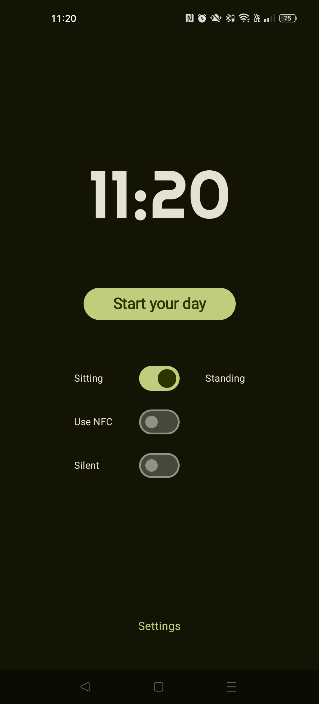
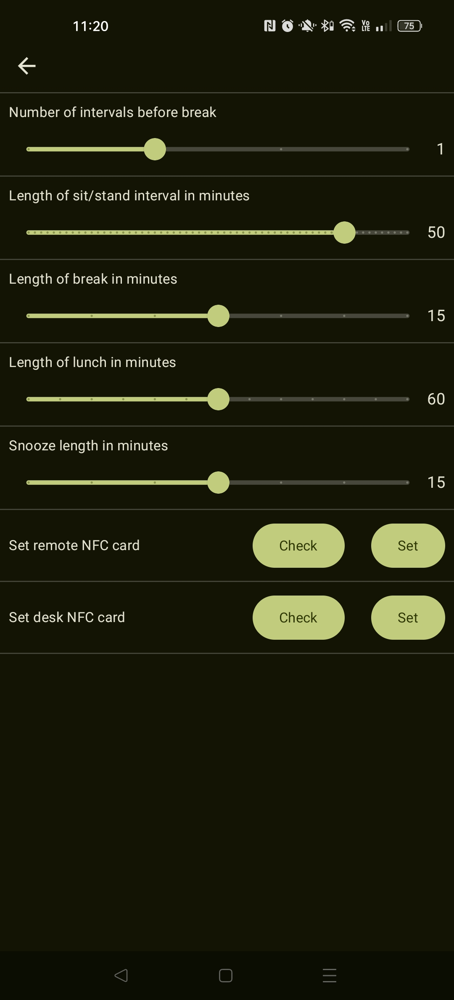
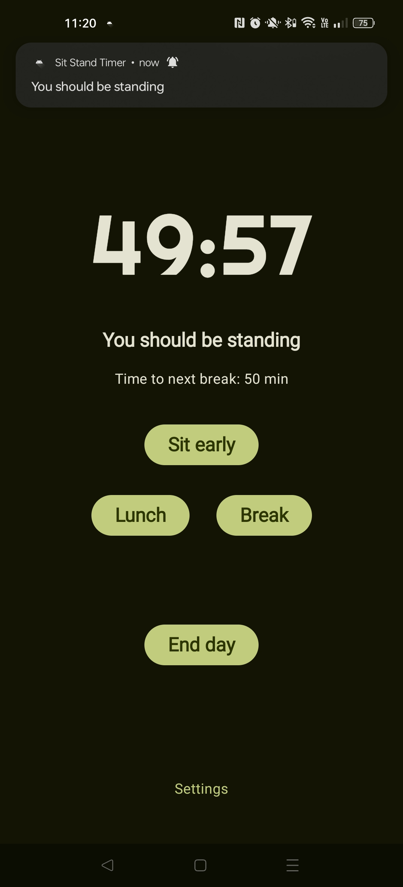
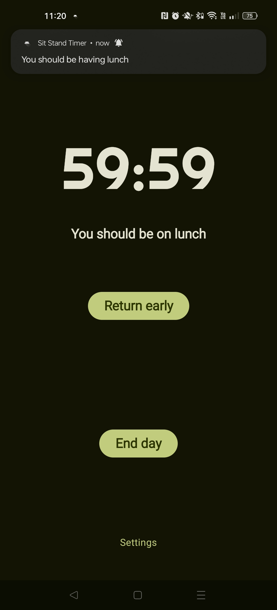
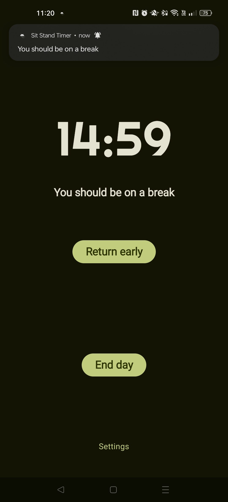
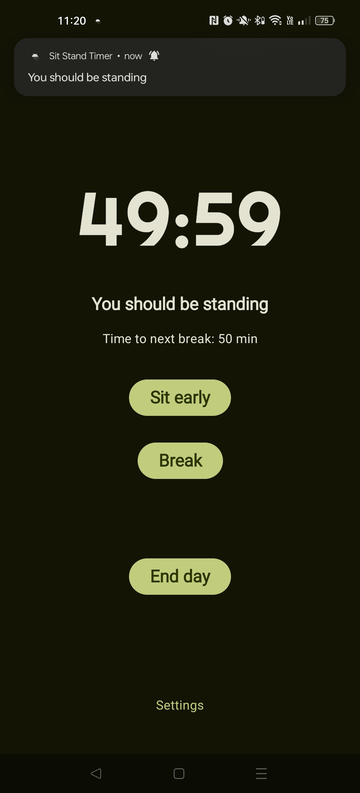
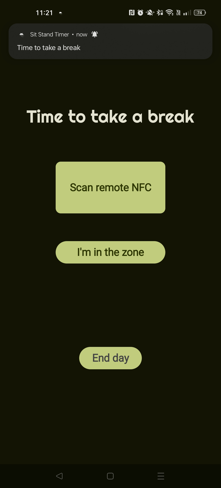
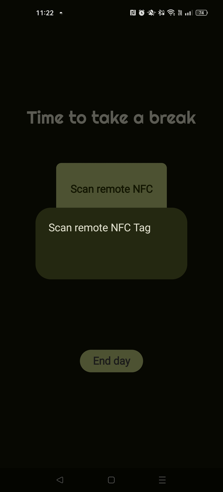

## Outline ##

This is a timer to be used for your work day, which will send a pushy reminder in an interval you set to tell you to alternate between standing and sitting.

For every few timers (defaults to two), it will require you to get up from your desk and scan a remote NFC tag to stop the alarm and start a break timer. On completion of the break timer you will need to scan your desk NFC tag to return to the sit/stand intervals.

NFC is turned off by default, so you will need to set the NFC tags in the settings to enable it.
Additionally, there is a silent mode which just has vibration for the alarms. 

It is intended that while WFH, one would have NFC turned on and silent mode off, and vice versa in an office setting...

All the timer lengths can be set in settings, and these are saved in a DataStore.

*Please allow background activity in your app settings for timer finished notifications to operate as expected on Android 12+*

## Design ##
The welcome page provides daily options as well as a link to the permanent settings page.
 

The timer running page changes based on the context of the timer, i.e. whether it is time to sit/stand, take lunch, or take a break. As well as whether it is pre- or post-lunch.
A persistent notification is present while the timer is running, which is also context dependent.
   

The alarm page is also timer-dependent and will tell the user to return to work or take a break, and will ask them to scan the relevant NFC tag if the NFC setting is used, or acknowledge the alarm otherwise.
 

### Background ###

I made this app as my first real program, after completing CS50 (this is the final project for it) and the Android Basics with Compose course.

There are undoubtedly some shortcomings, but it was made mostly as a learning experience and because I wanted to use the app myself. If you find said shortcomings, feel free to let me know.

Primarily, the app is built using Jetpack Compose, with display logic in the ViewModel and timer logic held within the TimerHelper class. However, the separation of concerns may not be ideal and the ViewModel does a lot of heavy lifting.
